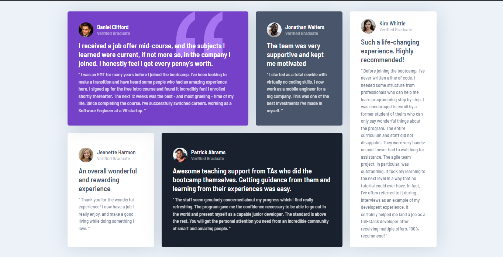

# Frontend Mentor - Testimonials grid section solution

## Table of contents

- [Overview](#overview)
  - [The challenge](#the-challenge)
  - [Screenshot](#screenshot)
- [My process](#my-process)
  - [Built with](#built-with)
  - [What I learned](#what-i-learned)
  - [Continued development](#continued-development)
  - [Useful resources](#useful-resources)
- [Author](#author)

## Overview

### The challenge

Users should be able to:

- View the optimal layout for the site depending on their device's screen size

### Screenshot

## My process

### Built with

- Semantic HTML5 markup
- CSS custom properties
- Flexbox
- CSS Grid
- Mobile-first workflow

### What I learned

What I learned was, you can probably design your entire layout with css grid only without touching on media queries.

### Continued development

Ofcourse, there is no ending when it comes to css grid. There is always something to learn under css grid to sharpen my skills.

### Useful resources

- [Css Tricks](https://www.csstricks.com) - Css Tricks got an in depth blog on css grid which i utilize a bit.

## Author

- George Asiedu - [@george5-star](https://www.frontendmentor.io/profile/@george5-star)
